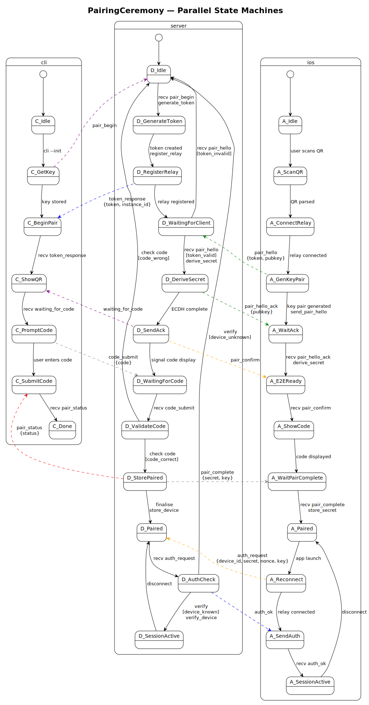

# Pigeon

Pigeon is a WebTransport relay library and server (Go + Swift) that enables
connections between devices where the backend sits on a private network
with no ingress. The relay forwards opaque ciphertext over QUIC — it never
sees plaintext traffic. Applications import pigeon's packages rather than
implementing relay, pairing, or crypto logic themselves.

## Trust Model

All application traffic is end-to-end encrypted:

- **Key exchange:** X25519 ECDH — each side generates an ephemeral key pair
  and derives a shared secret.
- **Symmetric encryption:** AES-256-GCM with monotonic counter nonces and
  directional key derivation via HKDF-SHA256.
- **MitM detection:** A 6-digit confirmation code derived from both public
  keys is displayed on each device. Users verify the codes match during
  the pairing ceremony.

The relay server handles only ciphertext and has no access to session keys.

## How It Works

1. A **backend** connects to `GET /register` via WebTransport. The relay
   assigns a unique instance ID and sends it back as the first message.
2. A **client** connects to `GET /ws/<instance-id>`. The relay bridges
   all traffic bidirectionally between the two WebTransport sessions —
   both reliable streams and unreliable datagrams.
3. Pairing and encryption happen above the relay layer, in the
   application, using pigeon's crypto and protocol packages.

## Go Library

```bash
go get github.com/marcelocantos/pigeon
```

```go
import (
    "github.com/marcelocantos/pigeon"
    "github.com/marcelocantos/pigeon/crypto"
    "github.com/marcelocantos/pigeon/protocol"
    "github.com/marcelocantos/pigeon/qr"
)
```

| Package    | Purpose                                                     |
|------------|-------------------------------------------------------------|
| root       | Client-side relay connectivity (register, connect, send/recv)|
| `crypto/`  | X25519 key exchange, AES-256-GCM channel, confirmation code |
| `protocol/`| Declarative state machine framework and pairing ceremony     |
| `qr/`      | Terminal QR code rendering and LAN IP detection              |

**Quick integration — relay + encrypted channel:**

```go
// Backend registers with the relay.
backend, _ := pigeon.Register(ctx, "https://carrier-pigeon.fly.dev", pigeon.Config{
    Token: os.Getenv("PIGEON_TOKEN"),
    TLS:   tlsConfig,
})
fmt.Println("Instance ID:", backend.InstanceID()) // share via QR code

// Client connects by instance ID (obtained from QR scan).
client, _ := pigeon.Connect(ctx, "https://carrier-pigeon.fly.dev", instanceID, pigeon.Config{
    TLS: tlsConfig,
})

// Send/receive through the relay (reliable stream).
client.Send(ctx, ciphertext)
data, _ := backend.Recv(ctx)

// Unreliable datagrams (for latency-sensitive data like video frames).
// Large payloads are automatically fragmented and reassembled; if any
// fragment is lost the entire message is silently discarded.
client.SendDatagram(data)
data, _ = backend.RecvDatagram(ctx)
```

**Encrypted channel:**

```go
// Both sides generate an ephemeral key pair and exchange public keys.
kp, _ := crypto.GenerateKeyPair()
// ... send kp.Public.Bytes() to peer; receive peerPubBytes ...
peerPub, _ := ecdh.X25519().NewPublicKey(peerPubBytes)

// Derive directional session keys and open an encrypted channel.
sendKey, _ := crypto.DeriveSessionKey(kp.Private, peerPub, []byte("client-to-server"))
recvKey, _ := crypto.DeriveSessionKey(kp.Private, peerPub, []byte("server-to-client"))
ch, _ := crypto.NewChannel(sendKey, recvKey)

// Verify the pairing is MitM-free (show 6-digit codes on both devices).
code, _ := crypto.DeriveConfirmationCode(kp.Public, peerPub)
fmt.Println("Confirmation code:", code) // e.g. "042857"

// Encrypt / decrypt messages sent through the relay.
encrypted := ch.Encrypt([]byte("hello"))
plaintext, _ := ch.Decrypt(encrypted)
```

## Swift Package

Add the GitHub repo as an SPM dependency:

```
https://github.com/marcelocantos/pigeon
```

The package provides the `Pigeon` library (iOS 16+, macOS 13+)
containing `E2ECrypto.swift` (key exchange and encrypted channel),
`TernRelay.swift` (relay connectivity), and the generated
`PairingCeremonyMachine.swift`.

```swift
// Both sides exchange public key bytes through the relay.
let kp = E2EKeyPair()
// ... send kp.publicKeyData; receive peerPubBytes ...
let sessionKey = try kp.deriveSessionKey(peerPublicKey: peerPubBytes,
                                         info: Data("client-to-server".utf8))
let channel = E2EChannel(sharedKey: sessionKey, isServer: false)
let encrypted = try channel.encrypt(plaintext)
let plaintext  = try channel.decrypt(ciphertext)
```

## Android/Kotlin Library

Add via [JitPack](https://jitpack.io) (Gradle):

```kotlin
// settings.gradle.kts
dependencyResolutionManagement {
    repositories {
        maven("https://jitpack.io")
    }
}

// build.gradle.kts
dependencies {
    implementation("com.github.marcelocantos.pigeon:pigeon:v0.5.0")
}
```

Requires JDK 17+ / Android API 33+ (for X25519).

```kotlin
// Key exchange
val kp = E2EKeyPair()
// ... send kp.publicKeyData (32 bytes); receive peerPubBytes ...
val sessionKey = kp.deriveSessionKey(peerPubBytes, "client-to-server".toByteArray())

// Encrypted channel from shared key
val channel = E2EChannel(sharedKey, isServer = false)
val encrypted = channel.encrypt(plaintext)
val plaintext = channel.decrypt(ciphertext)
```

## Pairing Ceremony

The full ceremony involves three actors — **server** (backend daemon),
**mobile** (iOS client), and **CLI** (initiator):

1. CLI sends `pair_begin` to server; server generates a one-time token,
   connects to the relay (`/register`), and receives an instance ID.
2. Server displays a QR code encoding the relay URL, token, and instance ID.
3. Mobile scans the QR, connects to `/ws/{id}`, generates an X25519 key pair,
   and sends `{token, pubkey}` to the server through the relay.
4. Server verifies the token, performs ECDH, derives the session key, and sends
   `pair_hello_ack {pubkey}` back. Mobile performs ECDH and derives the same key.
5. Both sides independently compute the 6-digit confirmation code from the two
   public keys. The server signals CLI to show the code; mobile shows it on screen.
   The user verifies the codes match — a mismatch means a MitM is present.
6. CLI submits the code the user entered. If correct, the server sends
   `pair_complete {secret, key}` to mobile and `pair_status` to CLI. Pairing done.



## Persistent Pairing

After the first pairing ceremony, save a `PairingRecord` for reconnection
without re-scanning the QR code:

```go
// After first pairing — save this securely
record := crypto.NewPairingRecord(backend.InstanceID(), relayURL, myKeyPair, peerPubKey)
data, _ := record.Marshal()
os.WriteFile("pairing.json", data, 0600)

// On reconnect — load and derive channel
data, _ = os.ReadFile("pairing.json")
record, _ = crypto.UnmarshalPairingRecord(data)
ch, _ := record.DeriveChannel([]byte("client-to-server"), []byte("server-to-client"))
conn, _ := pigeon.Connect(ctx, record.RelayURL, record.PeerInstanceID)
conn.SetChannel(ch)
```

The shared secret is never stored — it is re-derived on each reconnect from
the private key and peer public key via ECDH + HKDF. `PairingRecord` is
available on all platforms: Go (`crypto.PairingRecord`), Swift
(`PairingRecord`), Kotlin (`PairingRecord`), and TypeScript
(`PairingRecord` / `createPairingRecord` / `deriveChannelFromRecord`).

## Channels

Named streaming channels and datagram channels provide independent,
multiplexed communication paths over a single connection.

```go
// Streaming channels — independent ordered streams
ch, _ := conn.OpenChannel("game-state")
ch.Send(ctx, data)

peerCh, _ := conn.AcceptChannel(ctx)
data, _ := peerCh.Recv(ctx)

// Datagram channels — named, unreliable, both sides create by name
video := conn.DatagramChannel("camera-front")
video.Send(frame)
frame, _ := video.Recv(ctx)
```

Each streaming channel gets its own QUIC stream (no head-of-line
blocking between channels). Datagram channels share the QUIC datagram
pipe with a 2-byte channel ID prefix for demuxing.

## LAN Upgrade

When both peers are on the same LAN, traffic transparently switches
from the relay to a direct QUIC connection:

```go
// Backend: start a LAN server and register with the relay.
lan, _ := pigeon.NewLANServer("", nil)  // random port, self-signed cert
defer lan.Close()

backend, _ := pigeon.Register(ctx, relayURL, pigeon.Config{
    LANServer: lan,
})
backend.SetChannel(ch)  // triggers LAN address advertisement

// Client: enable LAN upgrade.
client, _ := pigeon.Connect(ctx, relayURL, instanceID, pigeon.Config{
    LAN: true,
})
client.SetChannel(ch)
// LAN upgrade happens automatically in the background.
```

The LANServer is a standalone QUIC listener that can serve multiple
clients. When a client receives the LAN offer (via the encrypted relay
channel), it dials the backend directly, verifies via a
challenge/response, and atomically swaps the Conn's transport. All
subsequent Send/Recv/SendDatagram/RecvDatagram go via LAN.

## Fault Injection Testing

The `faultproxy` package provides a transparent UDP proxy for testing
under adverse network conditions:

```go
proxy, _ := faultproxy.New(relayAddr,
    faultproxy.WithLatency(50*time.Millisecond, 20*time.Millisecond),
    faultproxy.WithPacketLoss(0.05),
    faultproxy.WithCorrupt(0.01),
)
defer proxy.Close()
// Connect to proxy.Addr() instead of the real relay.
```

Supports latency, jitter, packet loss, corruption, bandwidth
throttling, blackhole periods, sequence-aware drop (`WithDropAfter`,
`WithDropWindow`), and programmable per-packet hooks (`WithPacketHook`).

## Running the Relay Server

```bash
go build -o pigeon ./cmd/pigeon
PORT=443 ./pigeon                           # self-signed cert (development)
./pigeon --cert cert.pem --key key.pem      # production TLS certificate
```

The server is also deployable via Fly.io (`fly.toml` and `Dockerfile`
are included).

**Endpoints (HTTP/3 over WebTransport):**

| Route              | Description                               |
|--------------------|-------------------------------------------|
| `GET /health`      | Health check (returns `{"status":"ok"}`)  |
| `GET /register`    | Backend registers (WebTransport session)  |
| `GET /ws/{id}`     | Client connects by instance ID            |

## Configuration

| Flag / Env var | Default | Description |
|----------------|---------|-------------|
| `--port` / `PORT` | `443` | Listening port (UDP + TCP) |
| `--domain` | — | Domain for automatic Let's Encrypt TLS (e.g. `carrier-pigeon.fly.dev`) |
| `--acme-email` | — | Email for Let's Encrypt account |
| `--cert` | — | TLS certificate file (PEM); if `--domain` is not set |
| `--key` | — | TLS private key file (PEM); used with `--cert` |
| `PIGEON_TOKEN` | — | Bearer token required for `/register`; open if unset |
| `--version` | — | Print version and exit |
| `--help-agent` | — | Print usage + agent guide |

Build-time version injection: `go build -ldflags "-X main.version=v1.0.0" ./cmd/pigeon`

Max message frame size: 1 MiB (constant `maxMessageSize`).

## Running Tests

```bash
# Go — relay, crypto, protocol, and E2E integration tests
go test ./...

# Swift — crypto and state machine tests
swift test
```

## Protocol Code Generation

Protocols are defined in YAML (`protocol/pairing.yaml`) and used to
generate Go, Swift, TLA+, and PlantUML outputs:

```bash
go run ./cmd/protogen protocol/pairing.yaml
```

## Formal Model

A TLA+ specification (`formal/PairingCeremony.tla`) models the pairing
ceremony with an active adversary. Verified security properties include:

- No token reuse
- MitM detection via confirmation code mismatch
- Device secret secrecy
- Authentication requires completed pairing
- No nonce reuse

Run the model checker:

```bash
./formal/tlc PairingCeremony
```

## Licence

Apache 2.0 — see [LICENSE](LICENSE).
