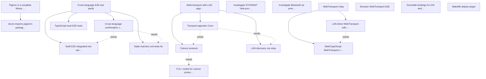

# Targets

## Active

### 🎯T10 Cross-language E2E test parity
- **Weight**: 2 (value 5 / cost 2)
- **Estimated-cost**: 2
- **Acceptance**:
  - Every language with generated state machine has automated E2E tests
  - Tests connect to real Go relay, exercise full pairing ceremony
  - Tests run in CI without manual intervention
- **Context**: Parent target. 3/4 sub-targets achieved (T10.1 Swift E2E, T10.2 state machine tests, T10.4 TypeScript local E2E). Only T10.3 (cross-language interop) remains.
- **Origin**: bootstrap from targets.md (T20)
- **Status**: Converging
- **Discovered**: 2026-04-08

### 🎯T10.1 Swift E2E integrated into swift test
- **Weight**: 2 (value 5 / cost 2)
- **Estimated-cost**: 2
- **Acceptance**:
  - XCTest target starts Go relay subprocess
  - Exercises register, connect, stream round-trip, encrypted round-trip, confirmation code verification
  - Runs via swift test
- **Context**: PigeonRelayE2ETests target in Package.swift with RelayE2ETests.swift. 6 tests pass via `swift test`.
- **Parent**: 🎯T10
- **Origin**: bootstrap from targets.md (T20.1)
- **Status**: Achieved
- **Achieved**: 2026-04-08
- **Discovered**: 2026-04-08

### 🎯T10.3 Cross-language confirmation code interop test
- **Weight**: 2 (value 5 / cost 2)
- **Estimated-cost**: 2
- **Acceptance**:
  - Go backend and each non-Go client perform full ECDH key exchange through live relay
  - Both sides independently derive 6-digit confirmation code
  - Test asserts both compute same code
- **Context**: Currently hardcoded '629624' in unit tests. No actual relay interop test. Depends on T10.1 (Swift) and T10.2.
- **Parent**: 🎯T10
- **Depends on**: 🎯T10.1, 🎯T10.2
- **Origin**: bootstrap from targets.md (T20.3)
- **Status**: Identified
- **Discovered**: 2026-04-08

### 🎯T10.4 TypeScript local E2E tests
- **Weight**: 2 (value 4 / cost 2)
- **Estimated-cost**: 2
- **Acceptance**:
  - Local E2E tests start Go relay subprocess
  - Tests run in CI without PIGEON_TOKEN credentials
- **Context**: relay.local.e2e.ts with GoRelayProcess.ts helper. 3 tests pass (register, round-trip, ordering). Also fixed pigeon-bridge port extraction bug.
- **Parent**: 🎯T10
- **Origin**: bootstrap from targets.md (T20.4)
- **Status**: Achieved
- **Achieved**: 2026-04-08
- **Discovered**: 2026-04-08

### 🎯T1 Pigeon is a complete library for opaque authenticated relay
- **Weight**: 2 (value 5 / cost 3)
- **Estimated-cost**: 3
- **Acceptance**:
  - All crypto, protocol state machines, code generators, QR helper, and Swift package live in pigeon
  - Applications import pigeon rather than duplicating relay/pairing logic
- **Context**: Parent target for the pigeon library. 7/8 sub-targets achieved — only T1.8 (jevon imports) remains.
- **Origin**: bootstrap from targets.md (T1)
- **Status**: Converging
- **Discovered**: 2026-04-08

### 🎯T1.1 Jevon imports pigeon's packages
- **Weight**: 2 (value 5 / cost 3)
- **Estimated-cost**: 3
- **Acceptance**:
  - Jevon's internal/crypto/, internal/protocol/, internal/qr/, and cmd/protogen/ are replaced by imports from pigeon
  - iOS app imports the Pigeon SPM package
- **Context**: Requires pigeon to be tagged and pushed. v0.15.0 released.
- **Parent**: 🎯T1
- **Origin**: bootstrap from targets.md (T1.8)
- **Status**: Identified
- **Discovered**: 2026-04-08

### 🎯T10.2 State machine unit tests for Swift/Kotlin/TypeScript
- **Weight**: 2 (value 5 / cost 3)
- **Estimated-cost**: 3
- **Acceptance**:
  - Each language has explicit unit tests for handleEvent
  - Tests verify state transitions for transport phase
  - Tests verify correct command emission per transition
  - Tests verify guard evaluation
- **Context**: Swift (22 tests) and TypeScript (22 tests) pass. Kotlin tests written but blocked on pre-existing codegen compilation errors (CmdID undefined, namespace collisions between SessionMachine/PathSwitchMachine).
- **Parent**: 🎯T10
- **Origin**: bootstrap from targets.md (T20.2)
- **Status**: Converging
- **Discovered**: 2026-04-08

### 🎯T4 Investigate STUN/NAT hole-punching as a transport
- **Weight**: 2 (value 3 / cost 2)
- **Estimated-cost**: 2
- **Acceptance**:
  - Investigation complete: STUN server requirements documented
  - UDP vs TCP hole-punching evaluated
  - Success rate across NAT types assessed
  - ICE vs simple STUN approach decided
  - Go and Swift library options identified
- **Context**: Middle-tier transport between relay and LAN. Pure research target.
- **Origin**: bootstrap from targets.md (T6)
- **Status**: Identified
- **Discovered**: 2026-04-08

### 🎯T9 Makefile deploy target
- **Weight**: 2 (value 3 / cost 2)
- **Estimated-cost**: 2
- **Acceptance**:
  - make deploy deploys to Fly.io, starts machine, waits for healthy
  - make e2e-live depends on deploy target
- **Context**: Deploy currently broken (Fly.io auth token). Fixing that is a prerequisite.
- **Origin**: bootstrap from targets.md (T17)
- **Status**: Identified
- **Discovered**: 2026-04-08

### 🎯T2 Multi-transport with LAN upgrade
- **Weight**: 1 (value 5 / cost 6)
- **Estimated-cost**: 6
- **Acceptance**:
  - Devices connected through relay can discover same LAN and upgrade to direct connection
  - pigeon.Conn abstraction hides transport — callers see single ordered message stream
- **Context**: Parent target. 1/4 sub-targets achieved (T5.1 reorder-tolerant decryption).
- **Origin**: bootstrap from targets.md (T5)
- **Status**: Converging
- **Discovered**: 2026-04-08

### 🎯T2.1 Cutover protocol
- **Weight**: 1 (value 5 / cost 5)
- **Estimated-cost**: 5
- **Acceptance**:
  - Each side sends CUTOVER marker as final message on old transport
  - Receiver reads from both transports, orders by sequence number
  - Old transport closed after receiving CUTOVER
- **Context**: Depends on TLA+ model (T3). Part of multi-transport LAN upgrade.
- **Parent**: 🎯T2
- **Depends on**: 🎯T3
- **Origin**: bootstrap from targets.md (T5.3)
- **Status**: Identified
- **Discovered**: 2026-04-08

### 🎯T2.2 Transport-agnostic Conn
- **Weight**: 1 (value 5 / cost 6)
- **Estimated-cost**: 6
- **Acceptance**:
  - pigeon.Conn manages multiple underlying transports
  - Sends go on preferred transport; receives from any transport in sequence order
  - Upgrading and downgrading transparent to caller
- **Context**: Depends on LAN discovery (T3.1) and cutover protocol (T2.1). Final piece of multi-transport.
- **Parent**: 🎯T2
- **Depends on**: 🎯T3.1, 🎯T2.1
- **Origin**: bootstrap from targets.md (T5.4)
- **Status**: Identified
- **Discovered**: 2026-04-08

### 🎯T3 TLA+ model for cutover protocol
- **Weight**: 1 (value 3 / cost 5)
- **Estimated-cost**: 5
- **Acceptance**:
  - TLA+ spec verifies no message lost during cutover
  - No message duplicated
  - No message delivered out of order
  - No deadlock
  - Concurrent cutover initiation from both sides is safe
- **Context**: Formal verification of transport switching logic. Blocks T5.3 (cutover protocol implementation).
- **Origin**: bootstrap from targets.md (T10)
- **Status**: Identified
- **Discovered**: 2026-04-08

### 🎯T3.1 LAN discovery via relay
- **Weight**: 1 (value 5 / cost 5)
- **Estimated-cost**: 5
- **Acceptance**:
  - Both sides exchange local IP addresses through relay after encrypted channel established
  - Each attempts direct WebTransport connection to peer's local address
- **Context**: First step in LAN upgrade path. No dependencies — can start immediately.
- **Parent**: 🎯T2
- **Origin**: bootstrap from targets.md (T5.2)
- **Status**: Identified
- **Discovered**: 2026-04-08

### 🎯T5 Investigate Bluetooth as proximity oracle
- **Weight**: 1 (value 2 / cost 2)
- **Estimated-cost**: 2
- **Acceptance**:
  - BLE advertising APIs on iOS/Android evaluated
  - Power/battery implications assessed
  - Interaction with pairing ceremony documented
  - Privacy considerations (MAC rotation) addressed
- **Context**: Bluetooth as proximity signal, not data channel. Could supplement confirmation code or gate LAN upgrade.
- **Origin**: bootstrap from targets.md (T7)
- **Status**: Identified
- **Discovered**: 2026-04-08

### 🎯T6 WebTransport relay
- **Weight**: 1 (value 5 / cost 5)
- **Estimated-cost**: 5
- **Acceptance**:
  - WebTransport (QUIC) is sole transport for relay path
  - Reliable streams for control/pairing
  - Unreliable datagrams for video/real-time data
- **Context**: Parent target. 3/5 sub-targets achieved. T8.4 (TypeScript client) and T8.5 (LAN direct) remain.
- **Origin**: bootstrap from targets.md (T8)
- **Status**: Converging
- **Discovered**: 2026-04-08

### 🎯T6.1 Web/TypeScript WebTransport client
- **Weight**: 1 (value 5 / cost 5)
- **Estimated-cost**: 5
- **Acceptance**:
  - Browser-native WebTransport API in web/
  - Reliable stream for control/pairing
  - Datagrams for video
- **Context**: Unblocked. Part of WebTransport relay target.
- **Parent**: 🎯T6
- **Origin**: bootstrap from targets.md (T8.4)
- **Status**: Identified
- **Discovered**: 2026-04-08

### 🎯T6.2 LAN direct WebTransport with cert fingerprint
- **Weight**: 1 (value 3 / cost 3)
- **Estimated-cost**: 3
- **Acceptance**:
  - Ephemeral self-signed cert for LAN listener
  - SHA-256 hash in LAN offer control message
  - Browser peers use serverCertificateHashes
- **Context**: Depends on T6.1 (Web/TypeScript client). Chromium-only initially.
- **Parent**: 🎯T6
- **Depends on**: 🎯T6.1
- **Origin**: bootstrap from targets.md (T8.5)
- **Status**: Identified
- **Discovered**: 2026-04-08

### 🎯T7 Browser WebTransport E2E
- **Weight**: 1 (value 3 / cost 3)
- **Estimated-cost**: 3
- **Acceptance**:
  - Browser WebTransport path works end-to-end against relay
  - Automated or documented manual verification process
- **Context**: Blocked on Playwright headless Chromium QUIC support. Alternatives: headed Chrome, Selenium, or manual.
- **Origin**: bootstrap from targets.md (T14)
- **Status**: Identified
- **Discovered**: 2026-04-08

### 🎯T8 Gomobile bindings for iOS and Android
- **Weight**: 1 (value 5 / cost 5)
- **Estimated-cost**: 5
- **Acceptance**:
  - iOS XCFramework importable from Swift
  - Android AAR importable from Kotlin
  - Go QUIC stack used by native apps
- **Context**: Replaces platform-specific QUIC libraries (Network.framework quirks, kwik bugs).
- **Origin**: bootstrap from targets.md (T15)
- **Status**: Identified
- **Discovered**: 2026-04-08

## Achieved

### 🎯T10.1 Swift E2E integrated into swift test
- **Achieved**: 2026-04-08
- **Context**: PigeonRelayE2ETests target in Package.swift with RelayE2ETests.swift. 6 tests pass via `swift test`.

### 🎯T10.4 TypeScript local E2E tests
- **Achieved**: 2026-04-08
- **Context**: relay.local.e2e.ts with GoRelayProcess.ts helper. 3 tests (register, round-trip, ordering). Fixed pigeon-bridge port extraction bug.

## Graph

